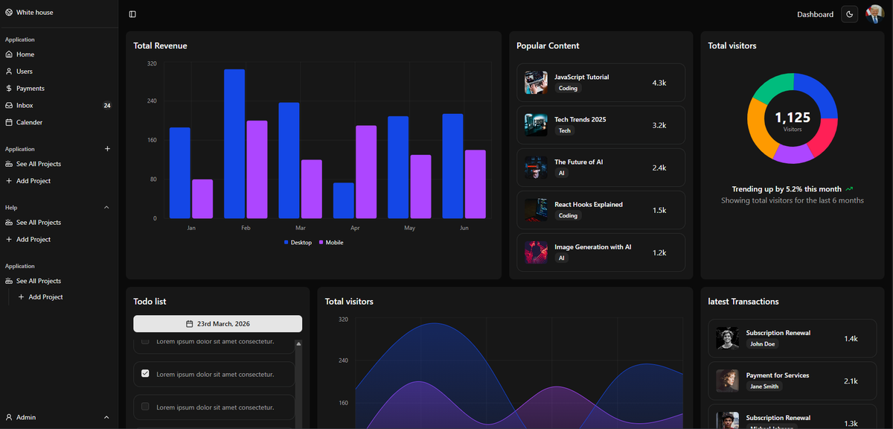

# Admin Dashboard UI


[](https://nextjs.org/)
[](https://ui.shadcn.com/)
[](https://tailwindcss.com/)
[](https://recharts.github.io/)
[](https://lucide.dev/icons/)



This is a [Next.js](https://nextjs.org) project bootstrapped with [`create-next-app`](https://nextjs.org/docs/app/api-reference/cli/create-next-app).

## Getting Started

First, run the development server:

```bash
npm run dev
# or
yarn dev
# or
pnpm dev
# or
bun dev
```

Open [http://localhost:3000](http://localhost:3000) with your browser to see the result.
